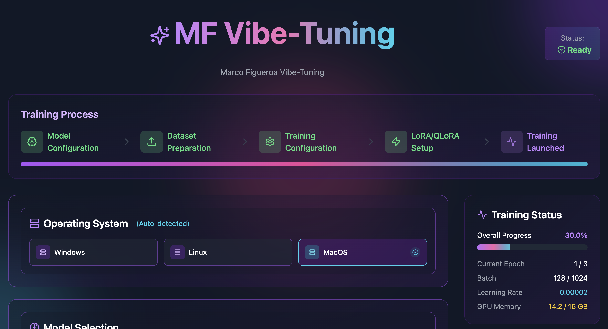

# MF Vibe-Tuning



A comprehensive vibe-tuning solution for Large Language Models by Marco Figueroa.

## Features

- Interactive UI for model vibe-tuning
- Support for various LLMs through Ollama
- Dataset preparation tools
- RLHF (Reinforcement Learning from Human Feedback) configuration
- LoRA/QLoRA adapter support
- Training pipeline with real-time analytics

## Structure

- `frontend/`: React-based UI for the vibe-tuning application
- `datasets/`: Sample and training data
- `phases/`: Documentation for each phase of the vibe-tuning process
- `ollama_api.py`: Integration with Ollama for model handling
- `train_pipeline.py`: Core training logic
- `rlhf_reward_model.py`: Implementation of the reward model for RLHF
- `lora_adapter.py`: LoRA adapter implementation

## Getting Started

1. Clone this repository
2. Set up the backend:

   ```bash
   # Install required packages
   pip install -r requirements.txt
   ```

3. Start the frontend:

   ```bash
   cd frontend
   npm install
   npm start
   ```

4. Access the application at [http://localhost:3000](http://localhost:3000)

## License

MIT
